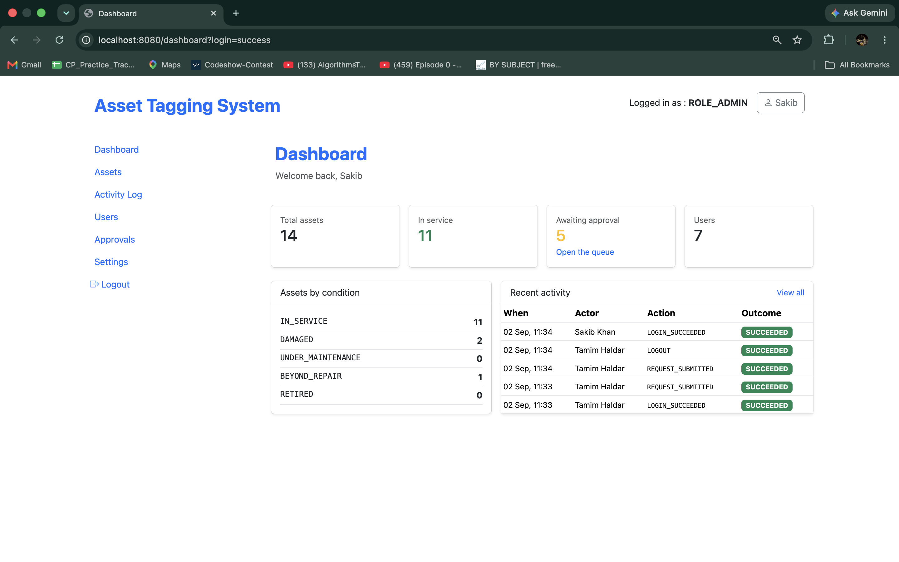
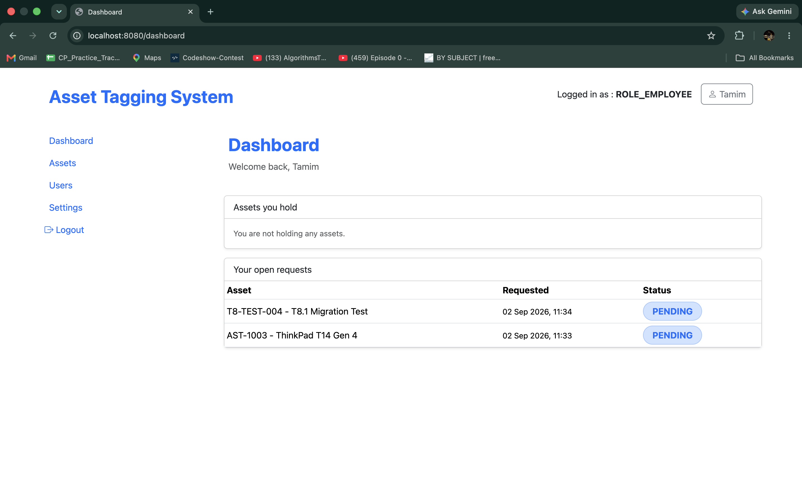
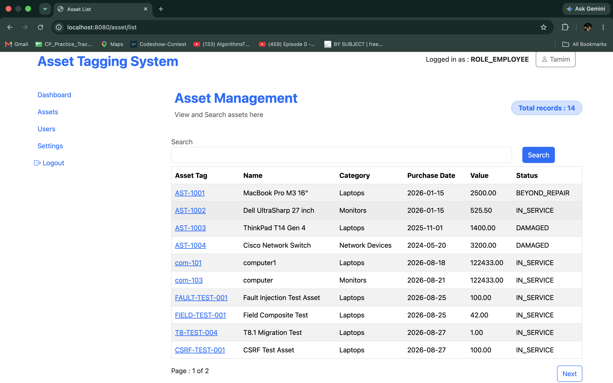
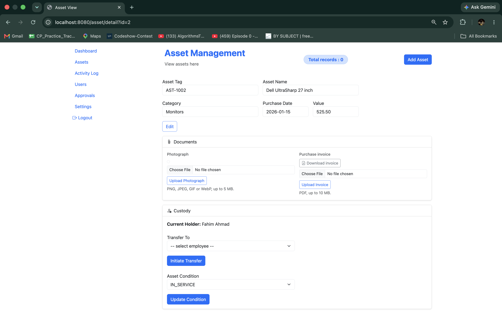
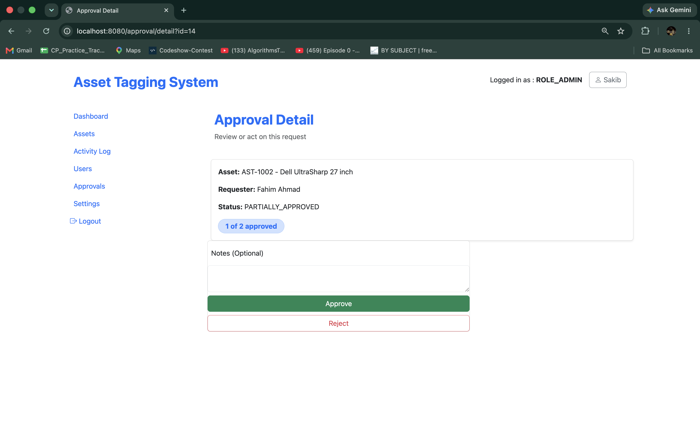
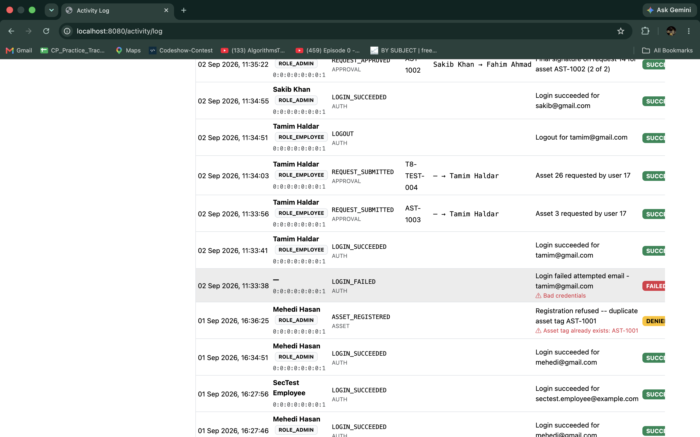
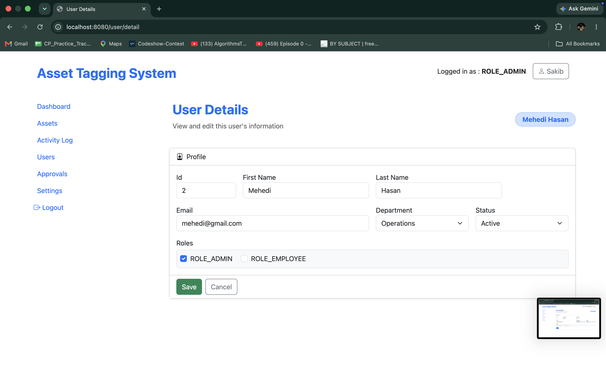
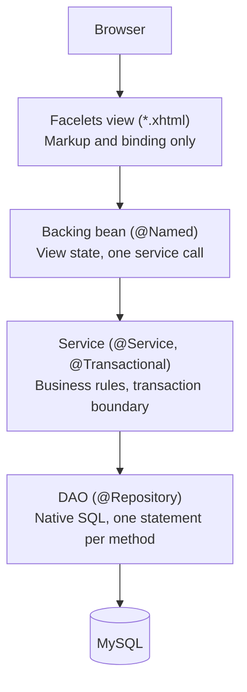
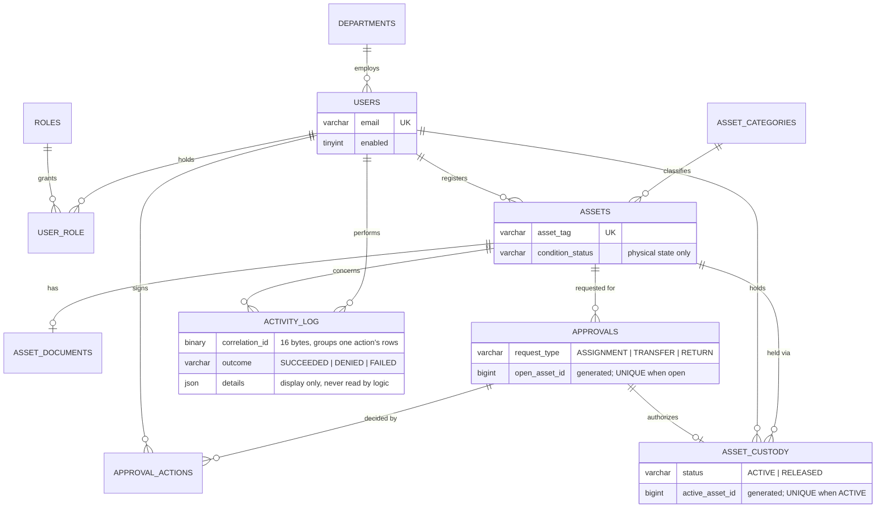

# Asset Tagging System

A web application for tracking company-owned physical assets across their working life:
registration, physical condition, which employee holds each item, the approval process
governing a change of holder, and a permanent, queryable record of every action taken on
the system.

## Screenshots

| Screen | Path | Shows |
|---|---|---|
|  | `/dashboard` | Admin view: summary cards, condition breakdown, recent activity |
|  | `/dashboard` | The same screen for `ROLE_EMPLOYEE` — only their own holdings and requests |
|  | `/asset/list` | Search and pagination, assets in several different conditions |
|  | `/asset/detail?id=<id>` | Read fields, Documents card, current holder, and the Transfer and Condition forms together — the two-axis model in the running application |
|  | `/approval/detail?id=<id>` | A `PARTIALLY_APPROVED` request with the Approve/Reject form |
|  | `/activity/log` | A `LOGIN_FAILED` and a `DENIED` row alongside successful ones — refusals are recorded, not dropped |
|  | `/user/detail?id=<id>` | The role/department edit form, admin-only |

## Domain concepts

| Concept | Definition |
|---|---|
| Asset | A tracked physical item, identified by a unique asset tag |
| Condition | The physical state of an asset: `IN_SERVICE`, `DAMAGED`, `UNDER_MAINTENANCE`, `BEYOND_REPAIR`, `RETIRED` |
| Custody | Which employee holds an asset, and for what period. An asset has at most one active custody record |
| Approval | A request to change custody (`ASSIGNMENT`, `TRANSFER`, or `RETURN`), requiring a configurable number of sign-offs |
| Approval action | One individual sign-off. A given user may act on a given approval only once |
| Activity log | The append-only record of every action performed in the system, successful or refused |

### Roles

| Role | Capabilities |
|---|---|
| `ROLE_ADMIN` | Registers, edits and retires assets; initiates transfers; approves or rejects requests; changes asset condition; views current holders; creates and edits user accounts; views the activity log |
| `ROLE_EMPLOYEE` | Requests an asset for themselves or returns one they hold; sees only their own held assets and open requests; cannot see who else holds a given asset |

## Architecture overview



| Layer | Responsibility |
|---|---|
| View | Bind values, render conditionally. No logic beyond a boolean test |
| Bean | View state, resolves the current actor, calls exactly one service method per action |
| Service | Transaction boundary, business rules, orchestrates DAOs, returns DTOs not entities |
| DAO | One native SQL statement per method (`EntityManager.createNativeQuery`) — no Spring Data repositories or JPQL anywhere in the project |

Every mutation and refusal is written to `activity_log` from the service layer, in the same
transaction as the action it records (exceptions documented in
[docs/ARCHITECTURE.md §8](docs/ARCHITECTURE.md#8-logging-and-audit)).

## Design decisions

### The two-axis model: condition and custody as independent facts

Many systems track an asset's state with one column — `AVAILABLE`, `ASSIGNED`, `DAMAGED`,
`RETIRED` — as if these were the same kind of fact. They are not: whether an asset is
physically sound and who holds it can be true or false independently of each other. A
single-status column forces a choice; writing `DAMAGED` into it silently discards the fact
that the asset was also checked out to someone.

This schema keeps them separate. `assets.condition_status` describes physical state only;
`asset_custody` — its own row per holding period — answers who holds it, if anyone. An asset
can be `DAMAGED` and held by an employee at the same time, correctly, because the two facts
occupy two places. A view, `asset_overview`, recombines them into one `AVAILABLE`/`ASSIGNED`
reading where the UI wants a single field.

*Everyday analogy:* a library keeps a book's condition ("cover needs rebinding") and its loan
status ("checked out to Alice") on two separate records. Filing both under one "status" field
would mean returning the book had to erase the fact it was damaged, or fixing the cover had to
erase the fact someone still has it.

### Invariants enforced by the database, not application code

Three rules are enforced as constraints, not `if` statements in a service method: at most one
open approval request per asset, at most one active custody record per asset, and at most one
sign-off per user per approval.

An application-level check — "if no open request exists, create one" — has a race condition:
two near-simultaneous requests can both pass the check before either commits, producing two
open requests for one asset. Code only prevents what it happens to run before the conflicting
write; it can't prevent the write itself.

Each table instead has a generated column that evaluates to `NULL` unless the row is the "live"
one (`active_asset_id` on `asset_custody`, `open_asset_id` on `approvals`), with a `UNIQUE`
constraint on that column. MySQL allows unlimited `NULL`s in a unique index but at most one real
value — so a second concurrent `INSERT` is rejected by the database itself, unconditionally,
rather than caught by a slower application check.

*Everyday analogy:* a parking garage with one numbered, physically marked spot doesn't rely on
an attendant remembering whether it's taken — the spot itself can't hold two cars. The database
plays that role instead of trusting application code to check correctly under concurrent load.

### Correlation IDs: grouping every log row one action produced

A single user action can write more than one activity-log row — approving the final signature
on a transfer writes a decision row, then a separate custody-change row, in one click. Without
something tying them together, those are just two entries that happened to occur close
together, with no way to prove later that they were the same event.

`CorrelationFilter` mints one UUID per incoming HTTP request; every row any service writes
during that request carries the same `correlation_id`, ordered by `sequence_in_action`. The
activity log screen groups rows by this id, so "these two rows were one action" is visible at a
glance instead of inferred from nearby timestamps.

*Everyday analogy:* a receipt number on a multi-item order. Three items on one receipt would
look like three unrelated purchases if nothing tied them together — the receipt number is what
makes them one transaction.

### Soft-close instead of deletion

Departments, asset categories and user accounts are never deleted. `departments.closed_at` and
`asset_categories.retired_at` mark a row as no longer available for new use; accounts are
withdrawn by clearing `users.enabled`, not by removing the row.

The reason is referential: `activity_log.actor_user_id`, `asset_custody.custodian_id`, and
`users.dept_id` all point at these rows as historical fact. Deleting one would either be blocked
by a foreign key or, worse, silently make history unreadable — "who approved this transfer in
2025" becomes unanswerable once the approver's row is gone. Filtering closed/disabled rows out
of a picklist happens at read time (`WHERE closed_at IS NULL`); the row, and everything
referencing it, stays intact indefinitely.

*Everyday analogy:* an access badge is deactivated when an employee leaves, not destroyed — the
building's entry log from a year ago still names a real person, not "unknown former employee."

## Data model



Full rationale for every choice above is in [docs/DESIGN.md](docs/DESIGN.md); the schema itself
is the source of truth at [V1__baseline_schema.sql](src/main/resources/db/migration/V1__baseline_schema.sql).

## Technology stack

| Layer | Technology |
|---|---|
| Language | Java 25 |
| Build | Apache Maven (wrapper included), WAR packaging |
| Application framework | Spring Boot 4.1 |
| Presentation | Jakarta Server Faces 4.1 (Mojarra), Facelets |
| JSF integration | JoinFaces 6.1 |
| Security | Spring Security |
| Persistence | Hibernate via `EntityManager`, native SQL exclusively |
| Schema management | Flyway |
| Database | MySQL 8 |
| Servlet container | Tomcat, embedded for development, external for deployment |
| Styling | Bootstrap 5.3 |

## Getting started

```bash
# 1. Create an empty database (Flyway builds the schema on first start)
mysql -u root -p -e "CREATE DATABASE asset_tagging_system
                     CHARACTER SET utf8mb4 COLLATE utf8mb4_unicode_ci;"

# 2. Supply local credentials
cp src/main/resources/application-local.properties.example \
   src/main/resources/application-local.properties
#    then edit DB_NAME, DB_USER and DB_PASS

# 3. Run
./mvnw spring-boot:run -Dspring-boot.run.profiles=local
```

The application starts on `http://localhost:8080`. Seeded development accounts and full
configuration detail are in [docs/SETUP.md](docs/SETUP.md).

## Documentation

| Document | Contents |
|---|---|
| [docs/ARCHITECTURE.md](docs/ARCHITECTURE.md) | Layers, request processing, dependency injection, security, audit mechanism, implementation status |
| [docs/MODULE_GUIDE.md](docs/MODULE_GUIDE.md) | How to add a feature, with conventions, anti-patterns and known pitfalls |
| [docs/DESIGN.md](docs/DESIGN.md) | Data-model rationale — why the schema has the shape it has |
| [docs/ENUM_REFERENCE.md](docs/ENUM_REFERENCE.md) | Every enumerated value, the column it backs, and where it is enforced |
| [docs/SETUP.md](docs/SETUP.md) | Environment setup, configuration, running, testing, deployment |

`src/main/resources/db/migration/` is the authoritative definition of the schema. Where any
document disagrees with the code, the code is correct and the document is to be updated.

## Known limitations / next steps

These are stated plainly because they are decisions made under a timeline, not oversights
discovered after the fact.

- **Automated test coverage is thin.** Currently a single Spring context-loads smoke test.
  A broader Testcontainers-based integration suite covering the audit-trail invariants (a
  refusal leaves no mutation; a successful action and its log row commit together; a disabled
  account can't authenticate) existed during development and was removed as a scope decision
  to prioritize finishing the feature set in the available time — not because those invariants
  don't need covering.
- **Authorization is enforced at the URL level, not the method level.** Spring Security's
  `requestMatchers(...).hasRole(...)` rules gate admin-only pages. The one authorization
  decision that depends on data rather than role — blocking an administrator from approving
  their own request — is enforced in the service layer and by a database `UNIQUE` constraint,
  not a declarative `@PreAuthorize` rule.
- **The activity log has no database-level immutability guarantee yet.** Nothing prevents an
  `UPDATE`/`DELETE` against `activity_log` beyond application discipline. Restricting the
  application's database grant to `INSERT`/`SELECT` only is a known, deferred hardening step.
- **Nothing is deployed.** The application runs locally against a local MySQL instance only.

---

**Left out rather than guessed:**

- Whether this was built solo or with collaborators — the commit history shows more than one
  author name (`sakib`, `fahim`, and commits merged from a `khan3575` GitHub organization).
  Adjust the README's framing to match reality before using it in an application.
- A license — there is no `LICENSE` file in the repository, so no license section was added.
